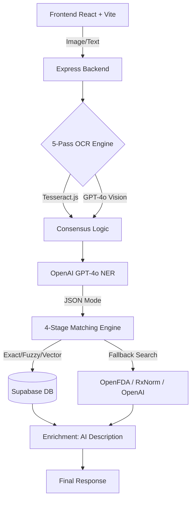

# 🧬 MedMap AI — Intelligent Medicine Extraction & Matching System

MedMap AI accepts prescription images — including messy, overlapping, or handwritten text — or raw medical text, extracts structured medicine data, and maps it to a trusted internal medicine database using a multi-stage hybrid matching engine. It returns structured JSON with similarity percentages, confidence scores, and AI-powered usage descriptions.

## 🚀 Recently Completed Milestones

### 1. **4-Stage Hybrid Matching Engine**
- **Stage 1 (Exact):** Direct database match by name and form.
- **Stage 2 (Fuzzy):** Trigram similarity for typo tolerance.
- **Stage 3 (Vector):** High-precision semantic search using `text-embedding-3-small`.
- **Stage 4 (Web Fallback):** Real-time search across **OpenFDA**, **RxNorm (NLM)**, and **OpenAI Knowledge** for medicines not found in the local database.

### 2. **AI-Powered Medicine Descriptions**
- **Real-Time Enrichment:** Every result now includes a concise, 1-line usage/indication description generated dynamically by GPT-4o.
- **Clinical Context:** Helps users understand the primary purpose of extracted medicines (e.g., "Amoxiclav 625 is used to treat bacterial infections").

### 3. **Premium UI/UX (V2.0)**
- **High-Fidelity Aesthetic**: Modern dark mode with glassmorphism, glowing accents, and fluid animations.
- **Provenance Labeling:** Clear visual badges for verification sources (e.g., "INTERNAL_DB", "Web Source: OpenFDA", "AI Knowledge").
- **Pipeline Visualization**: Real-time "Pipeline Stepper" to track OCR, extraction, and verification progress.

---

## 🏗️ Architecture



## 🛠️ Tech Stack

| Layer       | Technology                                    |
|-------------|-----------------------------------------------|
| **Frontend**| React 19 + Vite + Tailwind CSS 4             |
| **Backend** | Node.js 25 + Express (ESM)                   |
| **Database**| Supabase (PostgreSQL + pgvector + pg_trgm)   |
| **AI Models**| OpenAI GPT-4o (Vision + NER) + Text-3-Small |
| **OCR**     | Tesseract.js Premium Multi-Pass Consensus    |

## 🏁 Setup & Execution

### 1. Install & Configure
```bash
# Clone and install dependencies
git clone <repo-url> && cd medmap-ai
cd backend && npm install
cd ../frontend && npm install
```
*Create `backend/.env` with `OPENAI_API_KEY`, `SUPABASE_URL`, and `SUPABASE_SERVICE_KEY`.*

### 2. Initialize Data
```bash
# Import the medicine dataset (250k+ records)
cd backend
npm run import

# Start the background embedding generation process
npm run embeddings
```

### 3. Database Functions
Ensure you run the following SQL files in your Supabase SQL Editor:
1. `database/01_extensions.sql` — enables pgvector + pg_trgm
2. `database/04_functions.sql` — creates `hybrid_medicine_search()` function

### 4. Development
```bash
# Terminal 1: Backend (Port 3001)
cd backend && npm run dev

# Terminal 2: Frontend (Port 5173)
cd frontend && npm run dev
```

## 📊 Project Status
- **Database Size**: ~254,000+ records.
- **OCR Engine**: 5-Pass Parallel Vision Logic.
- **Verification**: Multi-Source Real-World Lookup (OpenFDA/RxNorm/OpenAI).
- **UI State**: V2.0 (Premium).

## 📄 License
MIT — Intelligent Healthcare Systems.
