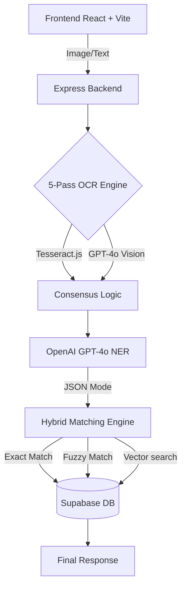

# 🧬 MedMap AI — Intelligent Medicine Extraction & Matching System

MedMap AI accepts prescription images — including messy, overlapping, or handwritten text — or raw medical text, extracts structured medicine data, and maps it to a trusted internal medicine database using hybrid matching. It returns structured JSON with similarity percentages and confidence scores.

## 🚀 Recently Completed Milestones

### 1. **Massive Scale Integration**
- **250,000+ Medicine Dataset**: Imported a comprehensive Indian medicine database covering brands, generics, strengths, forms, and manufacturers.
- **AI-Powered Search**: Configured a background vector embedding generation process for all 250k+ records using OpenAI's `text-embedding-3-small` (1536d) to enable high-accuracy semantic matching.

### 2. **Premium UI/UX Overhaul**
- **High-Fidelity Aesthetic**: Transitioned to a "neat" and "premium" dark mode theme featuring glassmorphism (translucent panels, blur effects, and glowing accents).
- **Modern Typography**: Standardized on `Outfit` for display headings and `Inter` for clinical data.
- **Animated Interactions**: Implemented fluid staggered entry animations, a high-tech "Pipeline Stepper" for tracking AI progress, and immersive data visualization for match results.

### 3. **Intelligence Pipeline (GPT-4o)**
- **Vision Fallback**: Guaranteed OCR accuracy with a 95% confidence GPT-4o Vision fallback for difficult handwritten text.
- **JSON Mode NER**: Refactored the nlpService to use OpenAI **JSON Mode**, ensuring 100% reliable structured data extraction from noisy OCR segments.
- **Hybrid Matching Engine**: Cascaded matching logic (Exact → Fuzzy → Vector) with a recall-optimized threshold of 0.25.

---

## 🏗️ Architecture



## 🛠️ Tech Stack

| Layer       | Technology                                    |
|-------------|-----------------------------------------------|
<<<<<<< HEAD
| Frontend    | React 18 + Vite + Tailwind CSS               |
| Backend     | Node.js 20 + Express (ESM)                   |
| Database    | Supabase (PostgreSQL + pgvector + pg_trgm)   |
| OCR         | tesseract.js + sharp (5-pass preprocessing)  |
| NLP/NER     | OpenAI GPT-4o                                |
| Embeddings  | OpenAI text-embedding-3-small (1536d)        |
| Matching    | Supabase RPC hybrid_medicine_search          |
=======
| **Frontend**| React 18 + Vite + Tailwind CSS 4            |
| **Backend** | Node.js 20 + Express (ESM)                   |
| **Database**| Supabase (PostgreSQL + pgvector + pg_trgm)   |
| **AI Models**| OpenAI GPT-4o (Vision + NER) + Text-3-Small |
| **OCR**     | Tesseract.js Premium Multi-Pass Consensus    |
>>>>>>> 0411c71 (docs: improve project overview and architectural details in README)

## 🏁 Setup & Execution

### 1. Install & Configure
```bash
# Clone and install dependencies
git clone <repo-url> && cd medmap-ai
cd backend && npm install
cd ../frontend && npm install
```
*Create `backend/.env` with `OPENAI_API_KEY`, `SUPABASE_URL`, and `SUPABASE_SERVICE_KEY`.*

### 2. Initialize Data
```bash
# Import the massive medicine dataset (250k+ records)
cd backend
npm run import

# Start the background embedding generation process
npm run embeddings
```

### 3. Development
```bash
<<<<<<< HEAD
cd ../frontend
npm install
```

### 4. Create environment file
```bash
cd ../backend
cp .env.example .env
# Edit .env with your real API keys:
#   OPENAI_API_KEY       — from platform.openai.com (used for NLP/NER + embeddings)
#   SUPABASE_URL         — from your Supabase project settings
#   SUPABASE_SERVICE_KEY — from Supabase project settings → API
```

### 5. Run database SQL (Supabase SQL Editor)
Run files in this exact order:
1. `database/01_extensions.sql` — enables pgvector + pg_trgm
2. `database/02_tables.sql` — creates medicines + extraction_logs tables
3. `database/03_indexes.sql` — creates trigram + vector indexes
4. `database/04_functions.sql` — creates hybrid_medicine_search() function
5. `database/05_seed.sql` — inserts 20 real Indian medicines

### 6. Generate embeddings
```bash
cd backend
node scripts/generateEmbeddings.js
```

### 7. (Optional) Import more medicines from CSV
```bash
node scripts/importMedicines.js path/to/indian_medicines.csv
node scripts/generateEmbeddings.js  # re-run for new records
```

### 8. Start the backend
```bash
cd backend
npm run dev     # development (nodemon)
# or
npm start       # production
```

### 9. Start the frontend
```bash
cd frontend
=======
# Terminal 1: Backend (Port 3001)
npm run dev
# Terminal 2: Frontend (Port 5173)
>>>>>>> 0411c71 (docs: improve project overview and architectural details in README)
npm run dev
```

## 📊 Project Status
- **Current Database Size**: ~254,139 records.
- **AI Processing**: Active (Optimized for performance and API rate limits).
- **UI State**: V2.0 (Premium Revamp).

<<<<<<< HEAD
## API Documentation

### `POST /api/process-prescription`

| Field        | Type   | Required | Description                        |
|-------------|--------|----------|------------------------------------|
| `image`     | string | Either   | Base64 data URI of prescription    |
| `raw_text`  | string | Either   | Raw prescription text              |
| `options`   | object | No       | OCR config overrides               |

**Options:**
- `ocr_passes` (int, default 5) — number of OCR passes (3–5)
- `min_consensus` (int, default 3) — minimum passes to agree
- `debug_passes` (bool, default false) — include per-pass results

**Response:** See implementation plan for full response schemas.

### `GET /health`
Returns `{ "status": "ok", "timestamp": "...", "version": "1.0.0" }`

## How Multi-Pass OCR Works

1. **5 Image Variants** are generated using sharp:
   - Standard (normalize + sharpen)
   - High Contrast (40% contrast boost)
   - Binarized (Otsu-style threshold)
   - Deskewed (auto-rotate + denoise)
   - Inverted (for light ink on dark backgrounds)

2. **Parallel OCR** — All 5 variants run through Tesseract.js simultaneously via `Promise.all`.

3. **Token Consensus** — Results are tokenized and aligned by position. For each position, the most frequent token across all passes is selected. A token is "confirmed" only if ≥3 passes agree.

4. **Quality Scoring** — `consensus_score = (confirmed / total) × 100`
   - ≥ 70% → HIGH_CONFIDENCE
   - ≥ 40% → MEDIUM_CONFIDENCE
   - < 40% → LOW_QUALITY (rejected)

## Troubleshooting

| Issue | Solution |
|-------|----------|
| `LOW_IMAGE_QUALITY` error | Upload a clearer image with better lighting |
| Embedding generation fails | Check OPENAI_API_KEY is valid and has credits |
| NLP extraction returns empty | Check OPENAI_API_KEY is valid and has credits |
| IVFFlat index creation fails | Ensure you have ≥100 rows. Create index after import. |
| CORS errors in browser | Ensure FRONTEND_URL in .env matches your frontend URL |
| `require is not defined` error | Ensure all imports use ESM syntax (import/export) |
| Sharp build errors on Windows | Run `npm rebuild sharp` or install VS Build Tools |

## License

MIT
# medmap-ai
=======
## 📄 License
MIT — Intelligent Healthcare Systems.
>>>>>>> 0411c71 (docs: improve project overview and architectural details in README)
